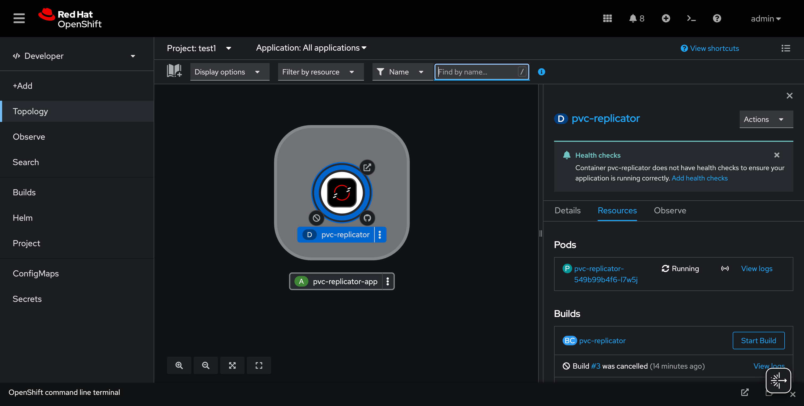
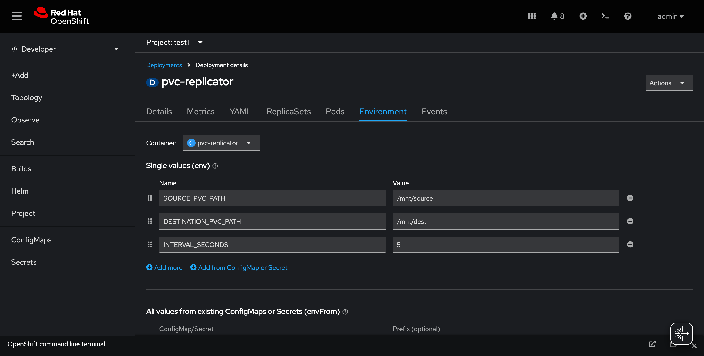
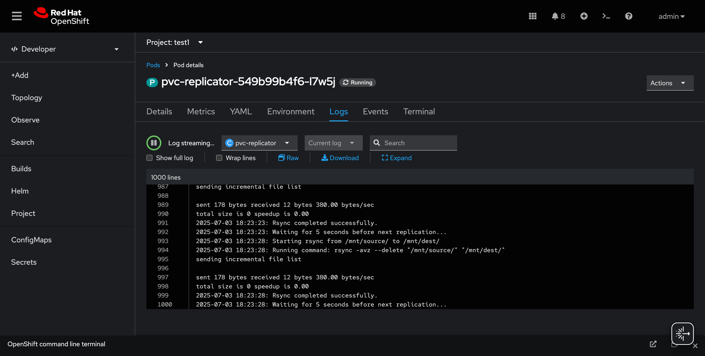
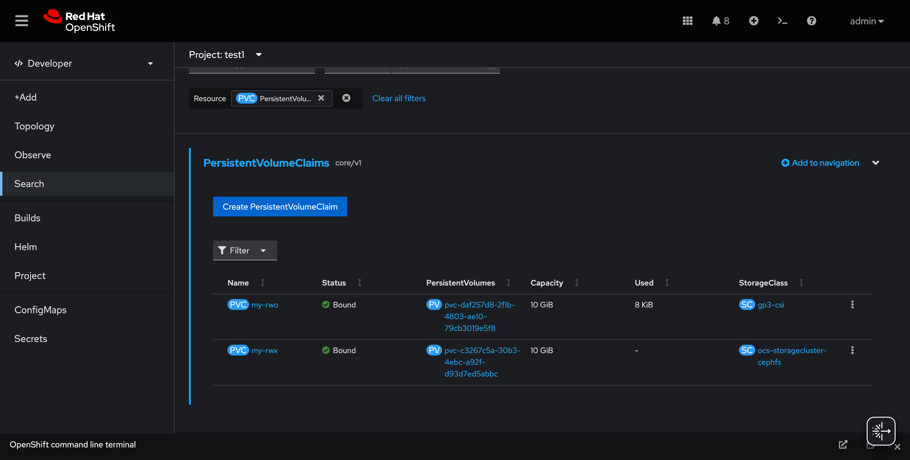

# PVC Replicator

## 📝 Project Overview

The `pvc-replicator` is a demo application designed to continuously replicate data from a source Persistent Volume Claim (PVC) to a destination PVC. This tool is useful for various scenarios including:

- **Storage migration**: Moving data between different storage classes (e.g., from vSAN RWX to AWS gp3 RWO)
- **Live backups**: Creating real-time mirrors of critical data
- **Volume synchronization**: Syncing content between single-writer (RWO) and multi-writer (RWX) volumes

The application mounts two PVCs (source and destination) and uses standard file system commands to copy content at configurable intervals.

## 🚀 Getting Started

Follow these steps to deploy the `pvc-replicator` on your OpenShift or Kubernetes cluster.

### Prerequisites

Before deploying, ensure you have:

- An OpenShift or Kubernetes cluster (tested with OpenShift)
- Configured StorageClasses:
  - `gp3-csi` for ReadWriteOnce volumes (e.g., `my-rwo`)
  - `ocs-storagecluster-cephfs` for ReadWriteMany volumes (e.g., `my-rwx` from OpenShift Data Foundation)
- `oc` (OpenShift CLI) or `kubectl` CLI tool configured for your cluster

### 1. Build and Push the Container Image

Choose one of the following deployment methods:

#### Option A: External Registry (Quay.io, Docker Hub, GCR)

```bash
# Navigate to the project root
cd pvc-replicator

# Build the Docker image
docker build -t your-registry.com/your-org/pvc-replicator:latest .

# Log in to your container registry (if private)
docker login your-registry.com

# Push the image
docker push your-registry.com/your-org/pvc-replicator:latest
```

#### Option B: OpenShift Internal Registry

If using OpenShift's internal registry and ImageStreams, adapt the `Dockerfile` and OpenShift `BuildConfig` accordingly.

> **Note**: Replace `your-registry.com/your-org/pvc-replicator:latest` with your actual image path.

### 2. Create Persistent Volume Claims (PVCs)

Navigate to the OpenShift directory and apply the PVC configuration:

```bash
cd openshift/
oc apply -f pvc-replicator-pvc.yaml -n test1
```

> **Note**: Adjust the namespace (`test1`) as needed for your environment.

### 3. Deploy the PVC Replicator Application

Apply the deployment configuration:

```bash
cd openshift/
oc apply -f pvc-replicator-deployment.yaml -n test1
```

> **Note**: Adjust the namespace (`test1`) as needed for your environment.

## 📊 Application Screenshots

The following screenshots show the application running in an OpenShift environment:

### Topology View


### Environment Configuration


### Pod Details


### PVC Status


## 🔧 Configuration

The application can be configured through environment variables in the deployment manifest. Key configuration options include:

- **Replication interval**: How frequently data is synchronized
- **Source and destination paths**: Mount points for the PVCs
- **Logging level**: Controls verbosity of application logs

## 📋 File Structure

```
pvc-replicator/
├── Containerfile
├── src/
│   ├── replicate.sh
├── openshift/
    ├── pvc-replicator-pvc.yaml
    └── pvc-replicator-deployment.yaml

```

## 🤝 Contributing

Contributions are welcome! Please feel free to submit issues and pull requests.
